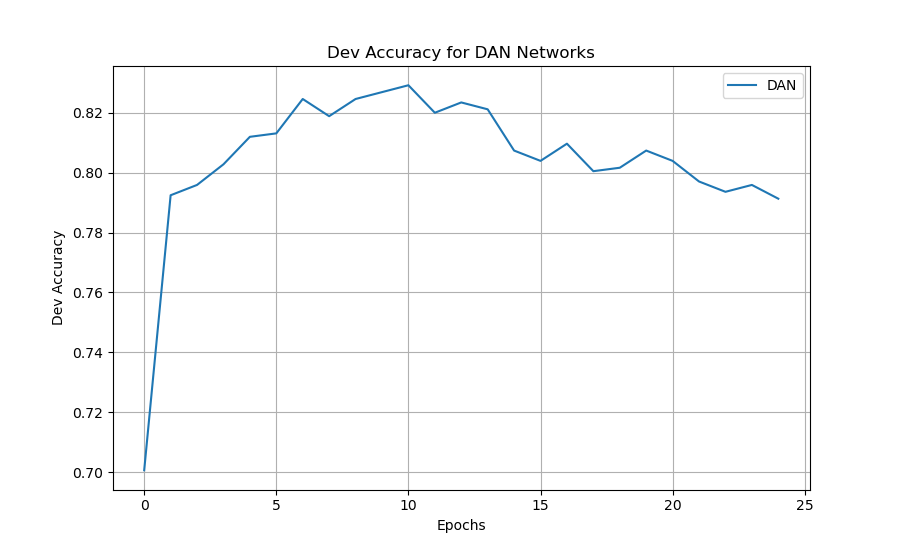
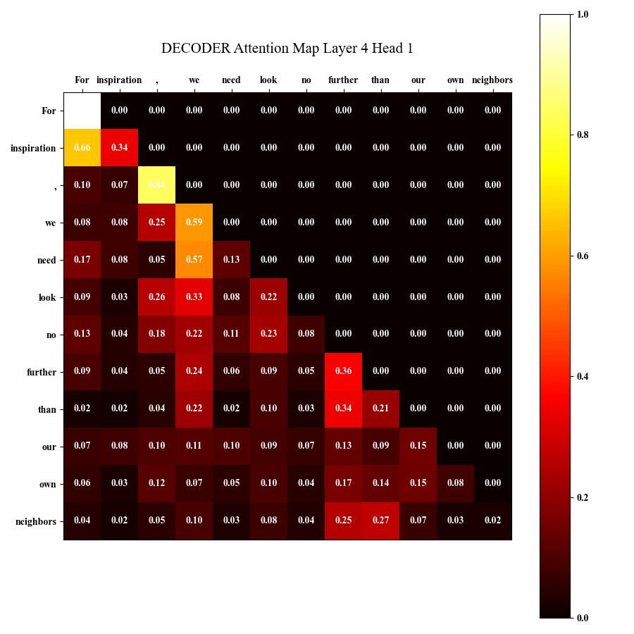

## This Repo is for CSE 256 LIGN 256 - Statistical Natural Lang Proc - Nakashole [FA24]
### Author: [Zhecheng Li](https://github.com/Lizhecheng02) && Professor: [Ndapa Nakashole](https://ndapa.us/)

----------------------------------------------------------------------------------------------

#### If you are only interested in code for PA1, [the repo is here](https://github.com/Lizhecheng02/UCSD-CSE256-PA1).

#### If you are only interested in code for PA2, [the repo is here](https://github.com/Lizhecheng02/UCSD-CSE256-PA2).

#### If you are only interested in code for PA3, [the repo is here](https://github.com/Lizhecheng02/UCSD-CSE256-PA3).

----------------------------------------------------------------------------------------------

### Python Environment

#### 1. Install Packages

```b
pip install -r requirements.txt
```

### Prepare Data
#### 1. PA 1

- You need to put the ``glove.6B.50d-relativized.txt`` and ``glove.6B.300d-relativized.txt`` files under the **PA1/data** folder.

##### (1) You could download all data using Kaggle Api

```bash
export KAGGLE_USERNAME="your_kaggle_username"
export KAGGLE_KEY="your_api_key"
```

##### (2) Install unzip if you are using a GPU server

```bash
sudo apt install unzip
```

##### (3) Download datasets ([Link](https://kaggle.com/datasets/7d4c9051944b3f7d0ef7d6e47e20fe260eef79bd6f3335fef47e2582a292d5a5))

```bash
kaggle datasets download -d lizhecheng/cse256-pa-data
unzip cse256-pa-data.zip
```

#### 2. PA 2 & PA 3

All datasets are already in the GitHub repo.


### Run Codes
#### 1. PA 1

##### 1.1 Attention.
**You can modify ``hidden_sizes``, ``output_size``, ``use_dropout``, ``dropout_rate``, ``lr``, and ``epochs`` at any time.**

***Hint:** You are always recommended to set the ``freeze_embed`` to ``False`` to get better results.*

##### 1.2 If you want to use "DAN" model with random embedding.
- Find the ``config.yaml`` file.
- Change the model to ``"DAN"``.
- Set the ``use_random_embed`` to ``True``.
- You can set the ``vocab_size`` as large as possible, such as ``20,000`` or even larger.
- Run ``python main.py`` under PA1 folder.

##### 1.3 If you want to use "DAN" model with pretrained GloVe embedding.
- Find the ``config.yaml`` file.
- Change the model to ``"DAN"``.
- Set the ``use_random_embed`` to ``False``.
- You can set the ``embed_file`` to the path of the GloVe txt file, such as ``glove.6B.300d-relativized.txt``.
- The ``input_size`` should be the same as the dimension of the glove embedding, ``50`` or ``300``.
- Run ``python main.py`` under PA1 folder.

**If you run it successfully using ``300d`` embedding and three layers DAN model, with around ``10`` epochs, you could get the dev accuracy to about ``0.820`` - ``0.830``.**

<div style="text-align: center;">
    
</div>

##### 1.4 If you want to use "DAN" model with new trained BPE tokenizer.
- Find the ``config.yaml`` file.
- Change the model to ``"DAN"``.
- Set the ``use_random_embed`` to ``True``.
- Turn on the ``use_bpe_trainer`` to ``True``.
- You can set the ``bpe_vocab_size`` to be an integer, but recommend ``15,000`` to ``25,000``.
- You are recommended to set the ``epochs`` to ``30`` or even larger, and the ``lr`` could be a little bit higher, such as ``3.0e-4``.
- Run ``python main.py`` under PA1 folder.

**If you run it successfully using appropriate ``bpe_vocab_size``, you should be able to get around ``0.75`` - ``0.77`` dev accuracy, the best accuracy I've ever got is ``0.779``.**

<div style="text-align: center;">
    
</div>

#### 2. PA 2
##### 2.1 Encoder
- If you want to train with ``traditional attention`` and ``mean embedding output``, use:

  ```bas
  python main.py --run "encoder_classic_mean"
  ```

- If you want to train with ``slide window attention`` and ``mean embedding output``, use:

  ```bas
  python main.py --run "encoder_window_attention"
  ```
  
- If you want to train with ``alibi relative positional embedding`` and ``mean embedding output``, use:

  ```ba
  python main.py --run "encoder_alibi"
  ```
  
- If you want to train with ``disentangled attention patterns`` and ``mean embedding output``, use:

  ```bas
  python main.py --run "encoder_deberta"
  ```
  
- If you want to train with extra **[cls]** token to represent the final embedding output, use:

  ```bas
  python main.py --run "encoder_cls_token"
  ```

You can change the parameters in ``main.py``, but you should be able to get around 86-87% accuracy using default values.

<div style="text-align: center;">
    
</div>

The code will draw attention plots after training for one specific sentence, they are saved under ``attention_maps`` folder. Here is an example:

<div style="text-align: center;">
    
</div>


##### 2.2 Decoder

- If you want to train the traditional decoder-only model for text generation, use:

  ```bas
  python main.py --run "decoder"
  ```

You can also change the parameters in ``main.py``, but you should be able to get around 6.5 loss using default values.

<div style="text-align: center;">
    
</div>

The code will also draw attention plots after training for one specific sentence, they are also saved under ``attention_maps`` folder. We can see the difference caused by attention mask. Here is an example:

<div style="text-align: center;">
    
</div>

#### 3. PA 3
You only need to run ``PA3_CSE256.ipynb`` file.